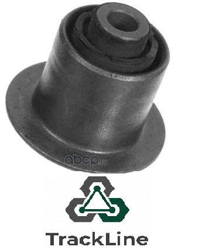
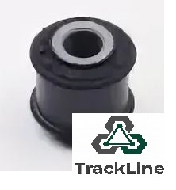
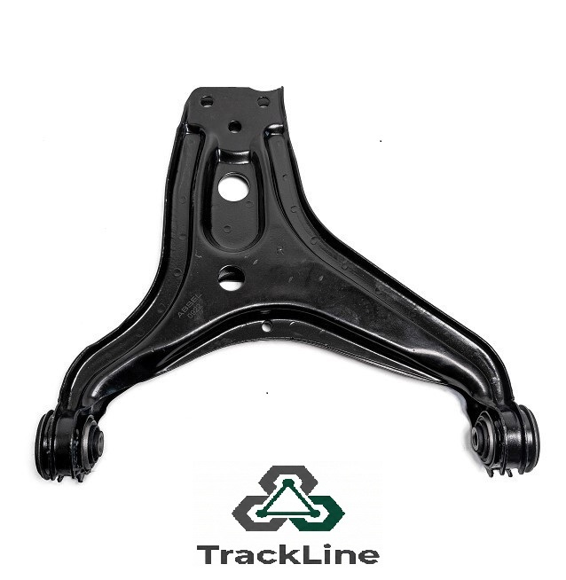
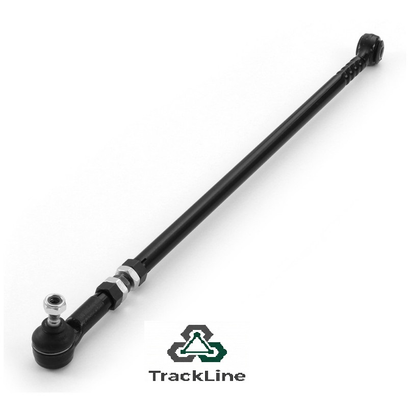
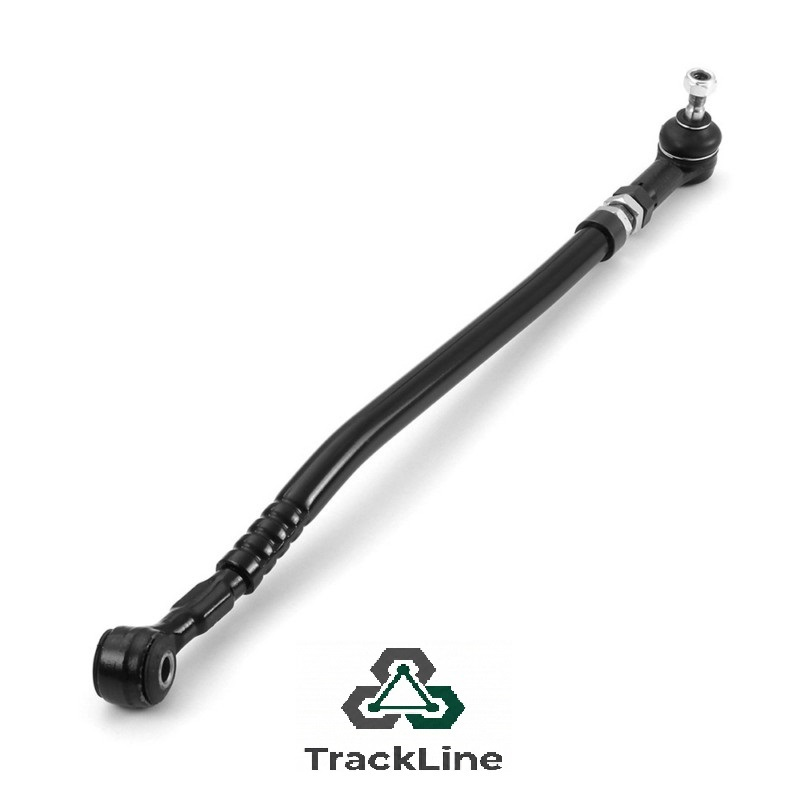
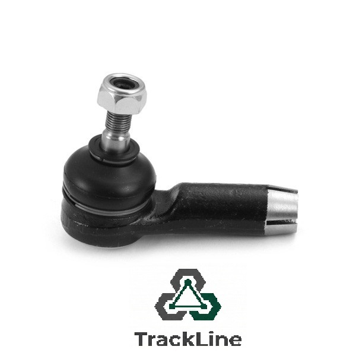
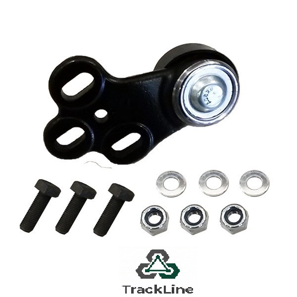
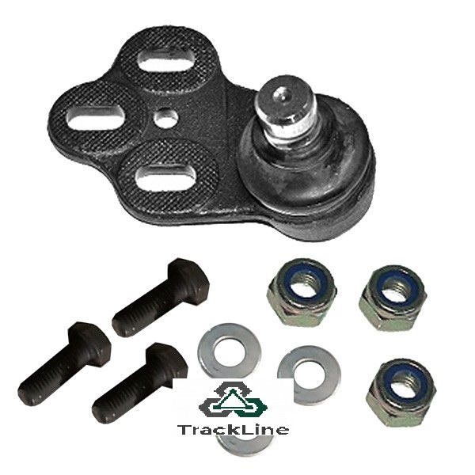
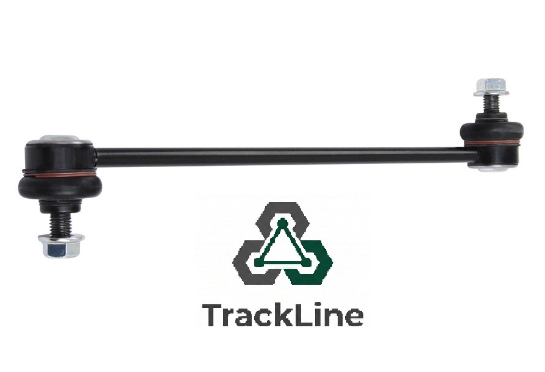

<header>
  <h1>TrackLine каталог ходовой Audi 80 B4</h1>
  
AUDI 80 B4 8C2, 8C5 09/1991-07/1995 · 2.0 (ABT) · 09/91-12/94

  

    Работает офлайн
    TrackLine подвеска и рулевое
    Специально для СТО и магазинов
  

</header>
<main>
<section class="model-card">
  

    
<strong>Производитель:</strong> AUDI

    
<strong>Модель:</strong> 80 B4 8C2, 8C5 09/1991-07/1995

    
<strong>Двигатель:</strong> 2.0 (ABT) 66 (90) kW (h.p.)

    
<strong>Годы:</strong> 09/91-12/94

    
<strong>Шасси:</strong> 8C-R-125 0-

  

</section>
<section class="cta-banner">
  

    
Подбор детали по ходовой Audi 80 B4 за 30 секунд.

    
Найдите строку в таблице и назовите продавцу код TrackLine.

  

  
Шаг 3: скажите код TrackLine

</section>
<table>
  <thead>
    <tr>
      <th>Фото</th>
      <th>TrackLine / Деталь</th>
      <th>OEM / Применяемость</th>
      <th>Позиция</th>
      <th>Стр.</th>
      <th>Заказ в 1 шаг</th>
    </tr>
  </thead>
  <tbody>
    <tr>
      <td></td>
      <td>
        
017-00594

        
Сайлентблок рычага

        
Подвеска

      </td>
      <td>
        
OEM: 857407181, 8A0407181

        
Применение: cil 4,5,6; ch 8C-R-125 0-

      </td>
      <td>Передний</td>
      <td>стр. 54</td>
      <td>
        
Назовите код TrackLine 017-00594

        
Покажите эту строку продавцу или сфотографируйте экран.

      </td>
    </tr>
    <tr>
      <td></td>
      <td>
        
032-00039

        
Сайлентблок рулевой тяги

        
Рулевое управление

      </td>
      <td>
        
OEM: 377419801, 811419801E

        
Применение: для ГУР; cil 4,5,6

      </td>
      <td>Рулевой</td>
      <td>стр. 54</td>
      <td>
        
Назовите код TrackLine 032-00039

        
Покажите эту строку продавцу или сфотографируйте экран.

      </td>
    </tr>
    <tr>
      <td></td>
      <td>
        
76-00594-1

        
Рычаг передний правый

        
Подвеска

      </td>
      <td>
        
OEM: 895407148A

        
Применение: cil 4,5,6; ch 8C-R-125 0-

      </td>
      <td>Передний правый</td>
      <td>стр. 54</td>
      <td>
        
Назовите код TrackLine 76-00594-1

        
Покажите эту строку продавцу или сфотографируйте экран.

      </td>
    </tr>
    <tr>
      <td></td>
      <td>
        
76-00594-2

        
Рычаг передний левый

        
Подвеска

      </td>
      <td>
        
OEM: 895407147A

        
Применение: cil 4,5,6; ch 8C-R-125 0-

      </td>
      <td>Передний левый</td>
      <td>стр. 54</td>
      <td>
        
Назовите код TrackLine 76-00594-2

        
Покажите эту строку продавцу или сфотографируйте экран.

      </td>
    </tr>
    <tr>
      <td></td>
      <td>
        
90-05901

        
Рулевая тяга (с ГУР)

        
Рулевое управление

      </td>
      <td>
        
OEM: 811419801C

        
Применение: для ГУР; cil 4,5,6

      </td>
      <td>Рулевой</td>
      <td>стр. 54</td>
      <td>
        
Назовите код TrackLine 90-05901

        
Покажите эту строку продавцу или сфотографируйте экран.

      </td>
    </tr>
    <tr>
      <td></td>
      <td>
        
90-05970

        
Рулевая тяга

        
Рулевое управление

      </td>
      <td>
        
OEM: 893419802

        
Применение: без ГУР; cil 4,5,6

      </td>
      <td>Рулевой</td>
      <td>стр. 54</td>
      <td>
        
Назовите код TrackLine 90-05970

        
Покажите эту строку продавцу или сфотографируйте экран.

      </td>
    </tr>
    <tr>
      <td></td>
      <td>
        
91-00908

        
Наружный наконечник рулевой тяги

        
Рулевое управление

      </td>
      <td>
        
OEM: 811419812A, 811419812B

        
Применение: наружный; cil 4,5,6

      </td>
      <td>Рулевой</td>
      <td>стр. 54</td>
      <td>
        
Назовите код TrackLine 91-00908

        
Покажите эту строку продавцу или сфотографируйте экран.

      </td>
    </tr>
    <tr>
      <td></td>
      <td>
        
93-05940-056

        
Шаровая опора правая (комплект)

        
Подвеска

      </td>
      <td>
        
OEM: 895407365, 8A0407365

        
Применение: комплект; ch 8C-N-175 5-; cil 4,5,6

      </td>
      <td>Нижняя правая</td>
      <td>стр. 54</td>
      <td>
        
Назовите код TrackLine 93-05940-056

        
Покажите эту строку продавцу или сфотографируйте экран.

      </td>
    </tr>
    <tr>
      <td></td>
      <td>
        
93-05941-056

        
Шаровая опора левая (комплект)

        
Подвеска

      </td>
      <td>
        
OEM: 895407366, 8A0407366

        
Применение: комплект; ch 8C-N-175 5-; cil 4,5,6

      </td>
      <td>Нижняя левая</td>
      <td>стр. 54</td>
      <td>
        
Назовите код TrackLine 93-05941-056

        
Покажите эту строку продавцу или сфотографируйте экран.

      </td>
    </tr>
    <tr>
      <td></td>
      <td>
        
97-05342

        
Стойка стабилизатора

        
Подвеска

      </td>
      <td>
        
OEM: 893407465, 893407465A, 8A0407465

        
Применение: cil 4,5,6

      </td>
      <td>Стабилизатор передней оси</td>
      <td>стр. 55</td>
      <td>
        
Назовите код TrackLine 97-05342

        
Покажите эту строку продавцу или сфотографируйте экран.

      </td>
    </tr>
  </tbody>
</table>
<section class="howto-block">
  <h2>Как использовать этот каталог</h2>
  <ol>
    <li><strong>Найдите модель.</strong> Убедитесь, что у клиента Audi 80 B4 2.0 ABT с нужным годом и шасси.</li>
    <li><strong>Выберите деталь по позиции.</strong> Сверьте узел, сторону, OEM и примечания (ГУР, комплект, шасси).</li>
    <li><strong>Назовите код TrackLine.</strong> Сообщите продавцу код из таблицы или покажите экран.</li>
  </ol>
</section>
<section class="expert-block">
  <h2>Экспертные рекомендации</h2>
  <ul>
    <li>Меняйте парные элементы (стойки стабилизатора, рычаги, шаровые, наконечники) с обеих сторон оси.</li>
    <li>После работ по рулевому выполняйте регулировку сход-развала.</li>
    <li>Для проверки применяемости всегда сверяйте OEM-номер с оригинальными каталогами VAG.</li>
  </ul>
</section>
<section class="positioning-block">
  <h2>Позиционирование каталога</h2>
  
Офлайн-каталог TrackLine для Audi 80 B4 создан для СТО и магазинов, которые хотят быстрее подбирать детали ходовой и рулевого, снижать количество ошибок и демонстрировать экспертизу по моделям VAG.

</section>
</main>
<footer>
TrackLine · Каталог ходовой Audi 80 B4 · Офлайн-версия для внутреннего использования СТО и магазинов
</footer>
